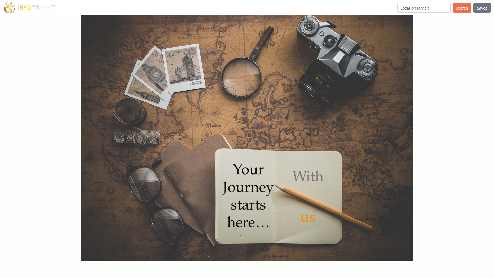

# InfoTravel Travel Information Finder

## Table of Contents
1. [URL](#url)
2. [Description](#description)
3. [Installation](#installation)
4. [Usage](#usage)
5. [Credits](#credits)

## URL 

A live version of this page has been deployed at https://spacepineapple.github.io/infotravel-travel-information/

## Description 

This page was created as our submission for the first group project of a Web
Development bootcamp. For this project, we were asked to design and implement
a solution to a real-world problem by creating a web page that integrates data
received from multiple server-side API requests. There was no user story and
limited acceptance criteria for this particular task. 

As a result, we decided to create a page that would allow a user to plan a trip
to a city while giving them all of the information they might require to assist
them in their planning. In particular, our solution provides a list of nearby
sight-seeing attractions, currency conversion information, relevant news
headlines for the location and weather information. Additionally, the page
allows users to view their previous search history and repeat previously
performed searches, while receiving new information from the queried APIs.

For this particular task, there were a number of conditions by which our page
would be assessed. The page needed to:

1. Use Bootstrap or another css framework
2. Be be deployed to GitHub Pages
3. Be interactive and to accept and respond to user input
4. Use at least two server-side APIs
5. Use modals rather than alerts, confirms, or prompts
6. Use client-side storage to store persistent data
7. Be responsive
8. Have a polished UI
9. Have a clean repository that meets quality coding standards 
10. Have a quality README

Additionally, a key part of this project task was to ensure that we understood
and were able to successfully navigate Git, GitHub and concepts such as
branching.

On first opening index.html or loading the live version of the page, a user
should see the start screen as follows:

After searching for a location or selecting a previously selected location, a
user will then be shown a different page with information for that location. The
images below show the two portions of the page

## Installation 

All of the required files are included in this repository and no installation
should be required. The index.html file should render in any modern browser on
both a desktop or mobile device. 

## Usage 

The page can be used by following the URL above or downloading the repository
files and opening the index.html file in the browser. Select the search bar in
the top right corner of the window and type the name of any city -- for example
"London" or "Paris". Following this, click on the search button to be taken to a
display of information about that city. Subsequent searches can then be made
using the search bar at the top of the page in the same manner or using the "new
search" or "saved destinations" buttons at the bottom of the main content block.
If starting a new search, simply type the search location. If repeating a search
for a previously saved location, select the location from the list and click the
corresponding button to reload information about that location.

## Credits 

This project was created by Julien Claivaz, Osman Dumbuya and myself, Neal
Reeves. The code was written by ourselves and no starter code was provided for
this project. However, the images used within the page are used in accordance
with the licenses associated with each image:

* Business Newspapers image created by AbsolutVision. Image can be
  found at: <a href="https://unsplash.com/photos/WYd_PkCa1BY">Unsplash</a>
* Woman near Building image created by Etienne Boulanger. Image can
  be found at: <a href="https://unsplash.com/photos/6-KiGzRZoeg">Unsplash</a>
* Ribblehead Viaduct image created by Tim Hill. Image can be found
  at <a href="https://pixabay.com/photos/ribblehead-viaduct-viaduct-bridge-2443085/">Pixabay</a>
* Road with Vanishing Point at Sunset created by hulv850627. Image can be found
  at <a href="https://www.freepik.com/free-photo/road-with-vanishing-point-sunset_1023253.htm">Freepik</a>
* Journey Adventure Photo Map Old createdby Dariusz Sankowski on Pixabay. Image
  can be found at <a href="https://pixabay.com/photos/journey-adventure-photo-map-old-1130732/">Pixabay</a>